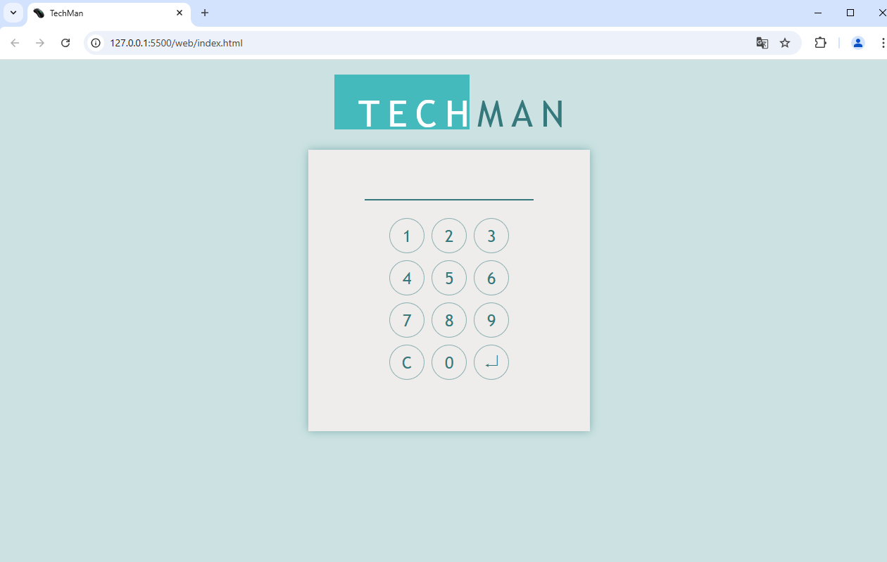
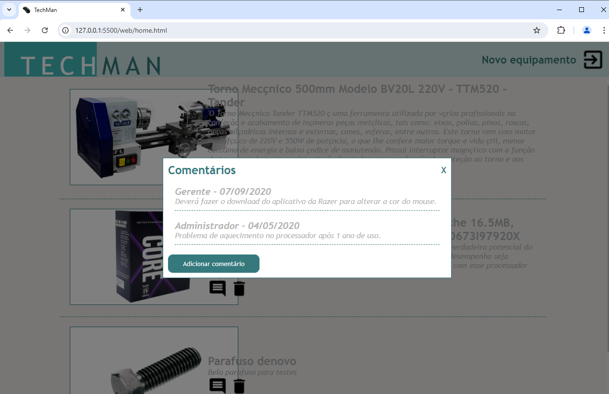
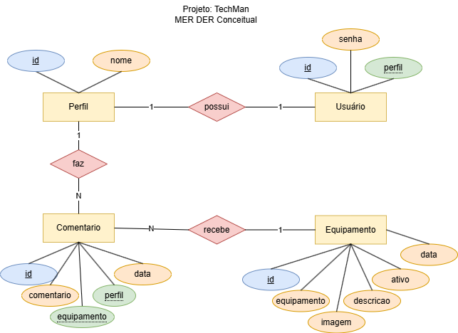
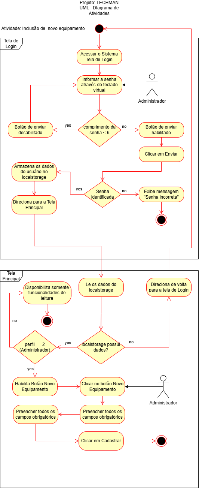

# TECHMAN
Situação Problema full stack, como solução para o desafio proposto na aula 09 de projetos do terceiro semestre do curso Técnico em Desenvolvimento de Sistemas, do SENAI Jaguariúna turma de 2024, repositório **senai2024/ds/3des/01-proj/aula09**

## Tenologias
|stack|Tecnologia|
|-|-|
|Front-End|[HTML](https://developer.mozilla.org/pt-BR/docs/Web/HTML)<br>[CSS](https://developer.mozilla.org/pt-BR/docs/Web/CSS)<br>[Vanilla-JavaScript](https://developer.mozilla.org/pt-BR/docs/Web/JavaScript)|
|Back-End|[Node.js](https://nodejs.org/)<br>[Express](https://expressjs.com/)<br>[Prisma](https://www.prisma.io/)|
|Banco de Dados|[XAAMP](https://www.apachefriends.org/pt_br/index.html)<br>[MySQL - MariaDB](https://www.mysql.com/)|
|IDE|[VSCode](https://code.visualstudio.com/)|
|Versionamento|[Git](https://git-scm.com/)<br>[Github](https://github.com)|

## Passo a passo para execução do projeto
- 1 Clone este repositório
- 2 Abra o XAMPP e dê **start** em Apache e o MySQL
- 3 Abra com VSCode, abra um terminal **cmd** ou **bash** e para executar o Back-End navegue até a pasta API e instale as dependências:
```bash
cd api
npm install
```
- 4 Crie o arquivo **.env** na pasta **api** e adicione a URL do banco de dados:
```js
DATABASE_URL="mysql://root@localhost:3306/techman?schema=public&timezone=UTC"
```
- 5 Execute o comando para criar as tabelas no banco de dados e semear com dados iniciais:
```bash
npx prisma migrate dev --name init
```
- 6 Execute o comando para iniciar o servidor:
```bash
npm run dev
#ou
node index.js
#ou
npx nodemon
```
- 7 Execute o Front-End navegando até a pasta **web** abrindo o arquivo index.html no navegador: com **Live Server** ou **Open with Live Server** ou **Open with Default Browser**



### DER


### UML - Diagrama de Atividades
